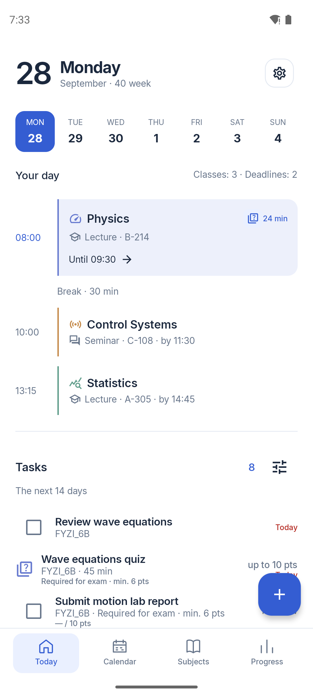
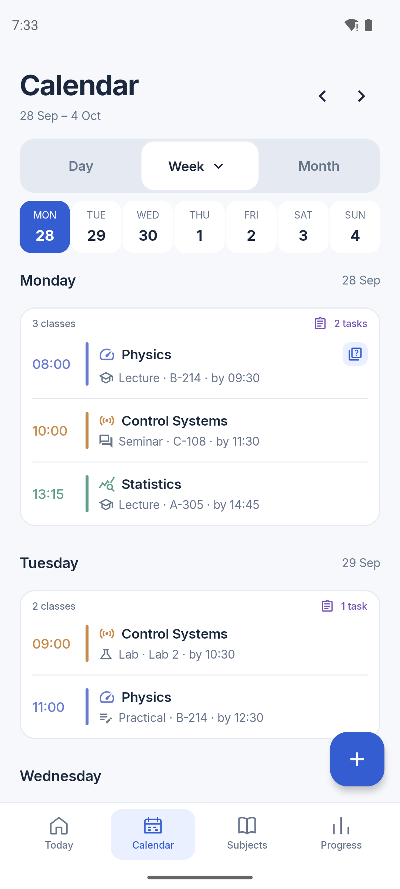
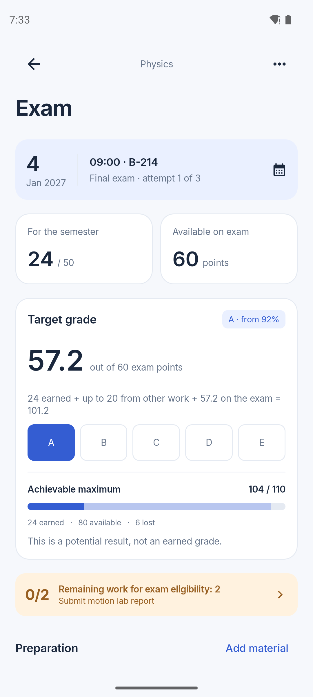
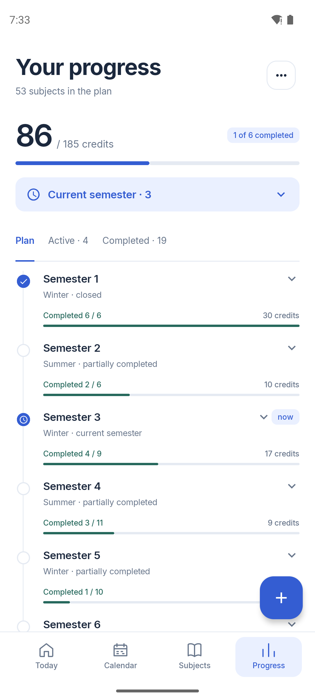

# Takt

Takt is an offline-first Android study planner for university schedules, grades, deadlines, and study progress.

Version 0.1.0 is an early release. Takt is built with Kotlin and Jetpack Compose, and its schedule, grades, and study plan are separate modules.

## Screenshots

| Today | Week list |
| :---: | :---: |
|  |  |
| Exam | Progress |
|  |  |

These screenshots use English example data on a Pixel 7 emulator. A new installation starts with an empty study plan, not the example schedule.

## Install

Download the signed APK from [Releases](https://github.com/Kpyruy/Takt/releases/latest). Takt supports Android 8.0 and newer. Back up `Documents/Takt` before replacing a debug build: a release APK has a different signing key and cannot update a debug installation in place.

## Modules

- `app` — Android entry point and navigation shell
- `core:model` — Android-free domain models and calculations
- `core:database` — Room database, entities, and DAOs
- `core:data` — repositories and local data orchestration
- `core:ui` — shared Compose theme and reusable UI components
- `feature:home` — dashboard and today's timetable
- `feature:calendar` — timetable/calendar
- `feature:subjects` — subjects and grade tracking
- `feature:studyplan` — six-semester study plan and credit progress
- `feature:settings` — app preferences, language, and backup controls

## Current target

Android, Kotlin, Jetpack Compose, Room, offline-first.

## Build locally

Use JDK 17, Android SDK platform 35 and build tools 35.0.0. Set `ANDROID_HOME` to your SDK directory, or put `sdk.dir=/absolute/path/to/Android/Sdk` in the ignored `local.properties` file.

```sh
./gradlew :app:assembleDebug
./gradlew :core:model:test :core:data:testDebugUnitTest :app:lintDebug
```

The wrapper pins Gradle 8.11.1 and verifies the distribution SHA-256. The Gradle wrapper and build configuration stay in Git so Android Studio can open the project; generated Gradle, Android Studio, and APK files are ignored. The debug APK is generated at `app/build/outputs/apk/debug/app-debug.apk`.

The interface supports Ukrainian, English, and Slovak. English is the default for new installs; choose another language during setup or in Settings. The choice is included in the `Documents/Takt` backup. To sign a release APK, use Android Studio's **Build → Generate Signed Bundle / APK → APK**, choose the **release** variant, and keep the keystore outside the repository. Use the same key for every update.

The opt-in `PulseFlowTest` writes review fixtures through the real repositories. Run it only on a disposable emulator (API 35 recommended), with `-e pulseReview true`; it is skipped without that flag.

## License

Takt's source code is [source-available](LICENSE), not open-source licensed. Reuse in another project requires prior written permission from Kpyruy, considered only for free projects with publicly available source code. Paid or commercial use is not permitted. Design screenshots and artwork are not granted for reuse. The bundled [Inter](core/ui/src/main/resources/META-INF/Inter-LICENSE.txt) font keeps its own license.
